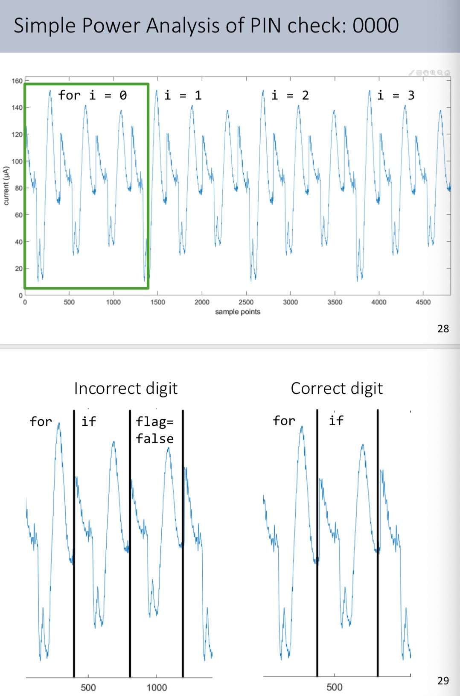
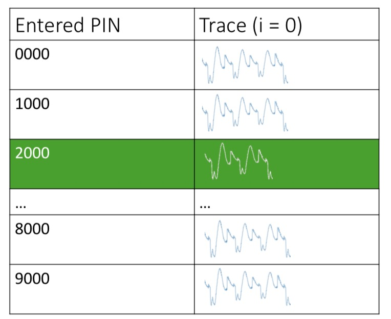
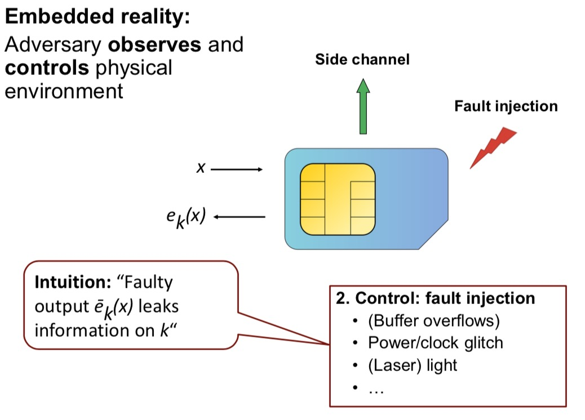
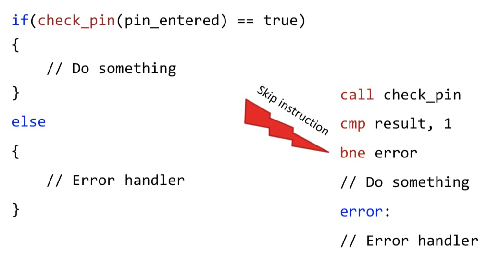

# Computer Security and Networks - Week Eleven

## Implementation Attacks

The classical security assumption:
Attacker knows x, e<sub>k</sub>(x) and e(), but **not** k.
Modern crypto is often safe against classical attacks, e() is such that they won't work.

#### Side-Channel Analysis
Like a safe may be cracked by listening to the 'clicks', many security systems have alternative ways of 'getting in the safe'. For example, you can use an oscilloscope to measure power consumption/run-time of an algorithm to get info electronic systems.

### Run-time/Timing Attacks
A typical PIN-checking function looks like this:
```c
bool check_pin(int pin_entered[4]) ≈ memcmp() {
    for(int i = 0; i < 4; i++) {
        if(pin_stored[i] != pin_entered[i]) {
            return false;
        }
    }
    return true;
}
```
You can check the run-time of different PINs in this function:

| Entered PIN | Runtime (μs) |
|-------------|--------------|
| 0000        | 134          |
| 1000        | 133          |
| **2000**    | **166**      |
| 3000        | 129          |
| 4000        | 133          |
| 5000        | 132          |
| 6000        | 134          |
| 7000        | 128          |
| 8000        | 136          |
| 9000        | 129          |

As you can see, the PIN '2000' took the longest to evaluate -  this is because it entered into the second iteration of the i-loop, i.e. the first digit is 2. We can do the same for the 2nd, 3rd, and 4th digits to find the correct PIN. (Though once you have digits 1,2 and 3 you can just brute force the last 10 possibilities).

An example of attack code for this is given [here](code/timing_attack).

### Cache Timing
The cache stores recently used data, fetching from cache (“hit”) is faster than from RAM (“miss”).
The attack works as follows:
- Flush the cache
- Run the victim
- Measure access times to victim memory

If the access time is very small, you know that the user is using data stored in cache (which you can then access and attempt to use yourself e.g. as possible encryption keys).

This allows you to check which memory locations have been accessed and which data was stored in the cache and which data in the memory.

An example of attack code for this is given [here](code/cache_timing).

Often cache-timing is used in conjunction with other exploits - it is just one building block of the famous exploits *Spectre* and *Meltdown*.

### Simple Power Analysis (SPA)
Consider this improved PIN-checking code. Every possible PIN should now take roughly the same amount of time to verify.
```
bool check_pin(int pin_entered[4]) {
    bool flag = true;
    for(int i = 0; i < 4; i++) {
        if(pin_stored[i] != pin_entered[i]) {
            flag = false;
        }
    }
    return flag;
}
```
By measuring the current drawn by the CPU ove time, you can line up the what the processor is doing with when, as shown here:


Similarly to the timing attack at the start, this information can then be used to recover the PIN digit by ditgit.


#### Other Possible Side Channels
- Temperature
- Sound
- Electro-magnetic emanations
- Photonic emissions

### Some Countermeasures
- (Cache) timing
    - No secret-dependent branches
    - No secret-indexed memory accesses
    - For example: use “bitslicing”
- Power analysis
    - “Balance” the power consumption (hard)
    - Generate noise (can be overcome with averaging)
    - Randomize timing (can be overcome with averaging)
    - Masking schemes (randomize internal values)

#### Overall
- Side-channel attacks use unintended side effects
- Independent of the mathematical security of cryptographic algorithms
- Relevant for both small embedded devices (smartcards) and large PC-grade CPUs
- There is also a related class of attacks: fault injection    

### Fault Injection
Of course, an attacker doesn't just have to *observe* the environment, they can also *control* and *alter* it to inject faults.


For example, you could inject a fault that causes the target machine to ignore an important 'if' check or error case. Below shows how if you skip the error message, you will get the `//do something` branch no matter what PIN you entered:


As a real-life example, there is a common variation of RSA called CRT-RSA which uses the Chinese Remainder Theorem to split one large mod calculation into two smaller mod calculations (this reduces run time by about a fact of 4). If you inject a fault to gain access to one of these small mod calculations, you can obtain a factor of the final private key and so are able to factorise easily to crack the encryption.

#### Undervolting Intel CPUs
Intel SGX is software that runs on intel CPUs consisting of HW + ucode extensions to run arbitrary x86_64 code in “enclaves”

Goal: Protect against adversary with root and even physical access (memory encryption)

The software exposed an interface in msr 0x150 that allowed attackers to control relative undervolting or set an absolute voltage. This opened up those CPUs to fault injection.

```c
uint64_t multiplier = 0x1122334455667788;
 uint64_t correct = 0xdeadbeef * multiplier;
  uint64_t var = 0xdeadbeef * multiplier;

while ( var == correct ) {
    var = 0xdeadbeef * multiplier;
}

// Can we ever get here? No
uint64_t flipped_bits = var ^ correct;
```

```c
uint64_t multiplier = 0x1122334455667788;
 uint64_t correct = 0xdeadbeef * multiplier;
  uint64_t var = 0xdeadbeef * multiplier;
// start undervolting
while ( var == correct ) {
    var = 0xdeadbeef * multiplier;
}
// stop undervolting

// Can we ever get here? Yes!
uint64_t flipped_bits = var ^ correct;
```
Here you're undervolting to inject a bit-flipping fault.

### Some countermeasures
- Detection-based:
    - Detect injection of fault (monitor environmental conditions)
    - Detect faulty result: compute twice (or more) and compare. Either in parallel or sequential.
- Algorithmic:
    - RSA / ECC: Verify signature after signing
    - Randomization in time (harder to inject fault)
    - “Infective” computation: fault randomizes result
