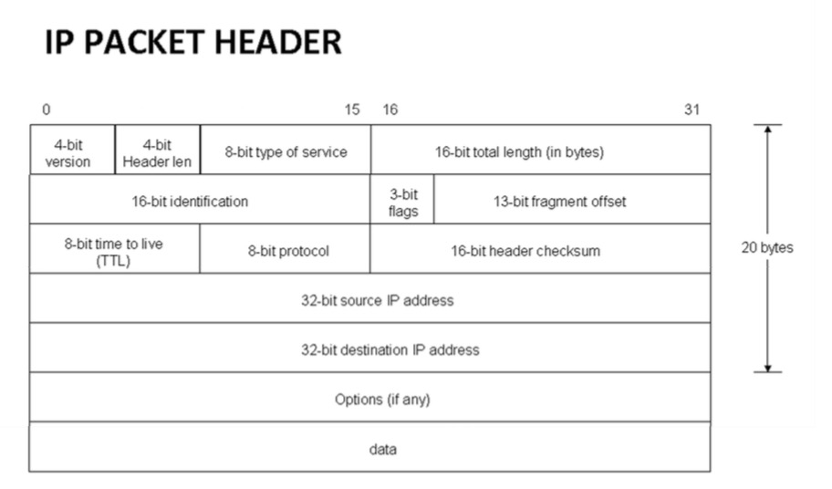
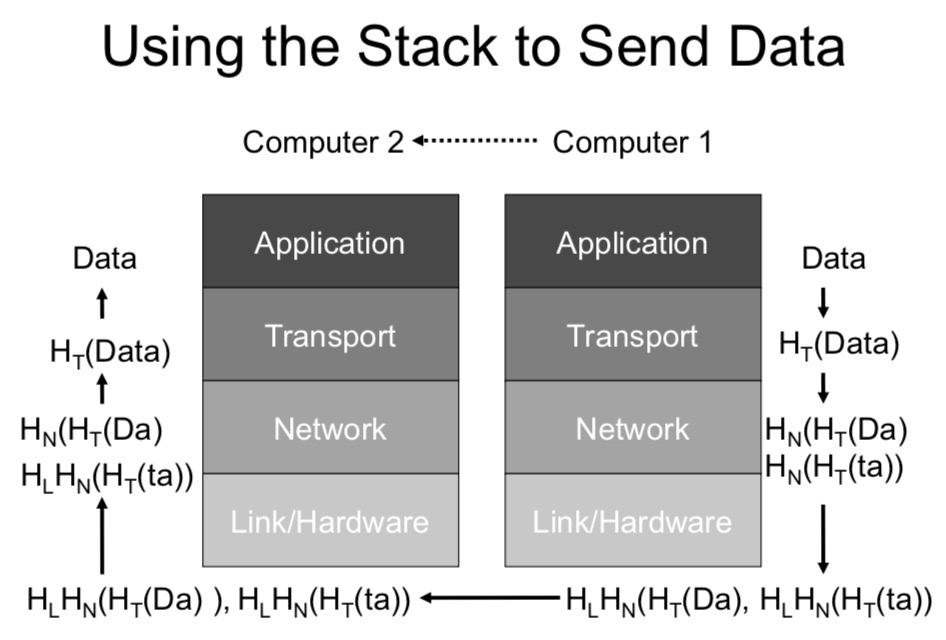

# Computer Security and Networks - Week Three

##### Authenticated Encryption Modes
*(From last week's lecture)*  
Authenticated Encryption modes stops cipher editing (like in ex1q2) - commonly done using MACs.
Calculate an AES CBC-MAC on the data, then encrypt the message followed by the mac using the same key and CTR mode.

## Access Control
A principal/subject (e.g. user) tries to perform an action (e.g. read) on an object/resource (e.g. a file). Access control is the act of using a 'resource monitor' to control whether or not *this* subject can perform *this* action on *this* resource (may block the action).

### Access Control Matrix
|                  | Operating System | Accounts Program | Accounting Data | Audit Trial |
|------------------|------------------|------------------|-----------------|-------------|
| Alice (manager)  | x                | x                | -               | -           |
| Bob (auditor)    | rx               | r                | r               | r           |
| Accounts Program | x                | r                | rw              | w           |
| Sam (sys admin)  | rwx              | rwx              | -               | -           |

Permissions: x: execute, r: read, w: write

Problem: maintaining such a matrix can be difficult - if the matrix is corrupted then all control is lost.

### Access Control Lists (ACLs)
Don't store the matrix, just store each column of the matrix woth the  object it refers to.

e.g. (Accounts data, [(Sam,r), (Bob,r),(Accounts program, rw)])

Unix/Linux/Mac use ACL, with groups. "uid" set when you log on, the linux kernel dynamically enforces the ALCs.
On linux you can see permissions with 'ls -l', will give you a string of the form  
[d][rwx][rwx][rwx]  
- [d] - the file type (d=directory, -=file, b/c=device file)  
- The next three lots of [rwx] refer to the read/write/execute permissions of the Owner, the Group and Others. (- signifies that the permission of the action in that place is not given, and an 's' in the place of an 'x' signifies that the process runs with the permission of its owner).  
On Linux, the user 'root' (with uid=0) has permission for everything.

Permissions can be important in keeping the machine working: e.g. running 'cp /etc/passwd /dev/sda' (in root mode where it is permitted) would break the OS since it would overwrite the start of the disk and break partitions used in the OS.

*(Password hashes actually stored on /etc/shadow, /etc/passwd just keeps track of what the passwords are used for.)*

### User Identifiers
- Have different user identifiers (uids):
    - real uid (ruid) owner of process.
    - effective uid (euid): used for access checks (except filesystem)
    - file system uid (fsuid): used for access checks and ownership of files (usually equal to effective uid)
    - saved user uid (suid): when the euid is changed, the old euid is saved as suid. Unprivileged process may change euid only to ruid or suid.
- provides flexibility for granting higher privileges temporarily
    - eg daemons: start as root (to bind to ports < 1024), then set ruid, euid and suid to unprivileged values. Cannot gain root privileges afterwards
    - Program run as privileged user may set euid to unprivileged value , then execute non-privileged operations, and gain root privileges afterwards

Some programs (e.g. bash) take the suid into account if asked to run. It should have root permission, but if suid=0 (root) it will run even if id!=0

### The Confused Deputy Problem
When a low level attacker gets a high level process to misuse its authority.
General race conditions look like:
`` if can_access file then perform_operations on file ``.   
**Need to make sure processes have as low a level privilege as possible**  

### Security

Windows stores its password hashes in: system32/config/SAM (file requires admin level to read). It is locked and encrypted with a key, based on other key values (though this adds no real security).

There are lots of Windows password crackers you can use if you get the SAM file into linux (where you can run the crackers).

Or you can replace the password hash and change the password (a 'password injection').

To counteract these you can set a password in the BIOS to stop the computer booting from anything but the hard disk.
- It’s very hard to brute force the BIOS.
- Work around: remove the hard disk from the computer or reset BIOS password.

But the best security is to encrypt either the most important files or the entire disk (though the key can be brute forced and this is not safe if the computer is in sleep mode).

#### Password Hashes in Windows
In a Windows Domain, passwords hashes are used to authenticate users on hosts in the domain
- Password hashes are cached to avoid asking for the password
- Gives rise to devastating attack (Pass-the-Hash)
    - Obtain user credentials for one host in the domain (eg phishing)
    - Exploit vulnerability to become local administrator (even on some old, odd machine no one thinks about in the system/corporation)
    - Install process which waits for domain administrator to login into this machine
    - Extract cached hash for domain administrator
    - Login as domain administrator
- Defence mechanism exist but are painful to use
- ssh much better: public key on untrusted machine, private key on trusted machine

##### SSH
Lets you log into other computers remotely. Uses public key authentication. Each computer has a folder ~/.ssh in which you have a public and a private key. Public key is sent over and the machine on the other side checks it with its private key to see whether you can log on. (Does mean that you *need* to protect your private keys).

## The Internet and Sockets

### Internet Protocol (IP(v4))

IPv4 - 232 addresses  
IPv6 - 2128 addresses (plenty)

Linux command 'traceroute' will list all intermediate places in which the packets you send somewhere pass through. (e.g. 'traceroute www.ucla.edu ' - good example because you can see the transmission time increase as the packets cross the Atlantic).

### Transmission Control Protocol (TCP)

Invented in 1974, requests that any packets which get lost in transmission be resent. TCP/IP allows inter network connections.

### Domain Name Servers (DNS)
A hierarchy of servers stores human-readable domain names (e.g. news.bbc.com) along with their IP address (212.58.226.141). Each server only needs to known one level of the address thanks to the hierarchy (e.g. 'com' server asks 'bbc' server asks 'news' server). Most of Europe's DNS info come through RIPE based in Amsterdam.

### Ports
Used to allow multiple connections through TCP. A TCP 'Socket' connection is defined by:  
`(destination IP, destination port, source IP, source port)`
- The destination port normally depends on the service: WWW runs on port 80, ssh on port 22, dns on 53...  
- The source port is normally chosen at random.

We may easily add networking into our java programs by making use of sockets (and the libraries which allow us to use them).

### Netcat
Netcat is a tool to make Internet connections. On Linux:
- listen on 1337: `nc –l 1337`
- connect to machine 127.0.0.1 on port 1337: `nc 127.0.0.1 1337`

`nmap` is another useful command:
- Check if 1000 most common ports are open: `nmap 127.0.0.01`
- Additionally send messages to ports to find
out what the service is: `nmap –A 127.0.0.01`
- Scan all ports: `nmap –p- 127.0.0.01`

### The Internet Protocol Stack
Each protocol uses the protocol below it to send data:
- Application - (Applications e.g. browser)
- -> Transport - TCP (dest IP, dest port, src IP, src port)
- -> Network - Internet Protocol (IP address)
- -> Link/Hardware - Ethernet + MAC address

### MAC and IP Addresses
- Every Machine has a unique MAC address (media access control), e.g. `48:d7:05:d6:7a:51`
- Every computer on the internet has an IP address, e.g. `147.188.193.15`
- NAT addresses `10.*.*.* 7` & `192.168.*.*` are not unique local addresses.

### DHCP & ARP
Dynamic Host Configuration Protocol (DHCP):
- Assigns an IP address to a new machine (MAC address). Not stored long term.

Address Resolution Protocol (ARP):
- Lets router find out which IP address is being used by which machine.

ARP spoofing lets one machine steal the IP address of another on the same network.

#### WireShark
WireShark (www.wireshark.org) is a network protocol analyser - records all internet traffic so it can be vied and analysed. Good for debugging protocols and network problems.  
*(See also tcpdump, which writes packets directly to disk)*

### Using the IP stack to send data

If packets are lost along the way, TCP ensures that they are resent so that the data fully makes it from Computer 1 to Computer 2.
