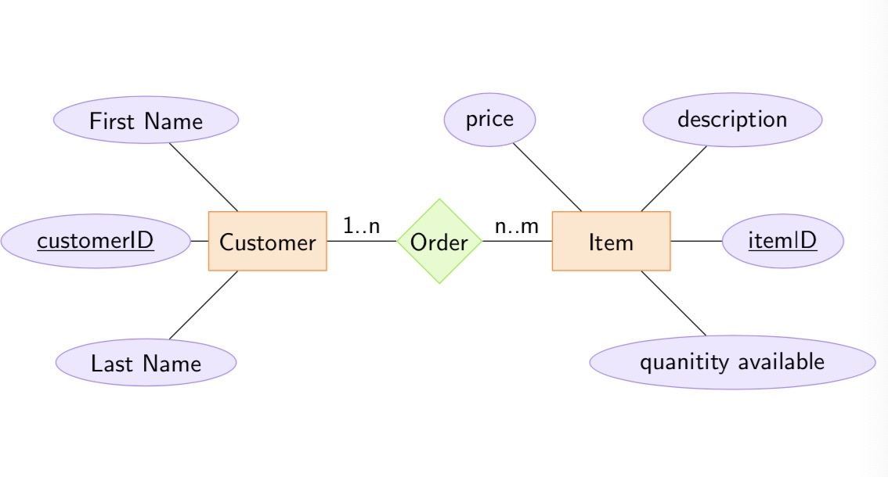

# Computer Security and Networks - Week Six

## Databases

Databases allow for efficient use of large amounts of data - most common type is based on sets and relations.
- *Domains* are sets of values.
- *Relations* are a mathematical relation between domains.
- *Attribute names* (or *attributes*) are a function from values to domains.
- *Relational schemas* are a finite set of attribute names.
- *Tuples* are elements of a relation.
- *Superkey* - a set of attributes which can always be used to differentiate one tuple from another (within a relation).
- *Key* - a minimal superkey.
- *Primary key* - a special key, often an integer which incremented for each new entry (like an id).
- *Foreign Key* - an attribute of the relation which is a key for another relation.

### SQL

Data is stored and administered using a database management system (e.g. postgres, MySQL).
We have a separate language for querying and operating on data called SQL in which:
- *Tables* represent relations. Columns are attribute names, rows are elements of the relation.
- We can specify primary of foreign keys explicitly.

#### Basic SQL Operations
- SELECT displays certain rows of tables
- INSERT inserts row into a table
- UPDATE updates rows of a table
- DELETE deletes rows of a table
- CREATE DATABASE creates new database
- DROP DATABASE deletes whole database (!)
- CREATE TABLE adds table to database
- DROP TABLE drops table of a database
- ALTER TABLE changes properties of a table

As an example we might create the following tables:
```SQL
CREATE TABLE customers (customerID integer PRIMARY KEY, firstname Text not null, lastname Text not null);

CREATE TABLE items (itemID integer PRIMARY KEY, description Text not null, quantityAvailable Integer not null, price Integer not null);

CREATE TABLE orders (orderID integer PRIMARY KEY, customerID integer REFERENCES customers(customerID));

CREATE TABLE orderItems (orderID integer REFERENCES orders(orderID), itemID Integer REFERENCES items(itemID), quantity Integer not null);
```

Then we may populate the database and perform operations on it as follows:

```SQL
INSERT INTO  customers (customerID, firstname, lastname) VALUES (1, 'Joe', 'Bloggs');
INSERT INTO  customers (customerID, firstname, lastname) VALUES (2, 'John', 'Smith');
INSERT INTO  customers (customerID, firstname, lastname) VALUES (3, 'Jane', 'Evans');

INSERT INTO items (itemID, description, quantityAvailable, price) VALUES (1, 'Laptop', 5, 25000);
INSERT INTO items (itemID, description, quantityAvailable, price) VALUES (2, 'Desktop', 10, 40000);
INSERT INTO items (itemID, description, quantityAvailable, price) VALUES (3, 'Mouse', 20, 1000);
INSERT INTO items (itemID, description, quantityAvailable, price) VALUES (4, 'Keyboard', 10, 2000);

INSERT INTO orders (orderID, customerID) VALUES (1, 3);
INSERT INTO orders (orderID, customerID) VALUES (2, 3);
INSERT INTO orders (orderID, customerID) VALUES (3, 1);

INSERT INTO orderItems (orderID, itemID, quantity) VALUES (1, 2, 1);
INSERT INTO orderItems (orderID, itemID, quantity) VALUES (1, 3, 2);
INSERT INTO orderItems (orderID, itemID, quantity) VALUES (1, 4, 1);

INSERT INTO orderItems (orderID, itemID, quantity) VALUES (2, 1, 1);
INSERT INTO orderItems (orderID, itemID, quantity) VALUES (2, 4, 1);

INSERT INTO orderItems (orderID, itemID, quantity) VALUES (3, 1, 1);
INSERT INTO orderItems (orderID, itemID, quantity) VALUES (3, 4, 2);


/* find all items orderd by Joe Bloggs */
SELECT orders.orderID, description, price FROM items, orderItems, orders, customers
WHERE orders.customerID = customers.customerID
  AND orderItems.orderID = orders.orderID
  AND orderItems.itemID = items.itemID
  AND lastname = 'Bloggs';

/* find all items orderd by Jane Evans */
SELECT orders.orderID, description, price FROM items, orderItems, orders, customers
WHERE orders.customerID = customers.customerID
  AND orderItems.orderID = orders.orderID
  AND orderItems.itemID = items.itemID
  AND lastname = 'Evans';

/* Change the price of laptops */
UPDATE items SET price = 30000 WHERE description = 'Laptop';
```
(*Notice how each 'SELECT' is followed by many id comparisons to avoid returning the cartesian product of two (or more) of the fields we want.*)

### Database Design
Database design usually captured by Entity-Relationship (ER) diagrams.
These can be easily mapped to database schema.  
Components of ER diagrams:
 - Oval - attributes
 - Rectangle - entity set
 - Diamond - relation set
 - Lines - showing links, and kind of relationship:
    - one-to-one (1..1)
    - one-to-many  (1..n)
    - many-to-many (n..m)

An example of an Entity-Relationship diagram is:



## Web Services
'[Burp](https://portswigger.net/burp)'' is a good cybersecurity tool for tracking web services by looking at http(/s) packets received on your computer. A version is installed on this module's VM.

Supplementary material on website design can be found in [this](11_WebNotes.pdf) notes file, [this](11_Web_Code.pdf) code file, and on the [W3Schools](https://www.w3schools.com/) website.
