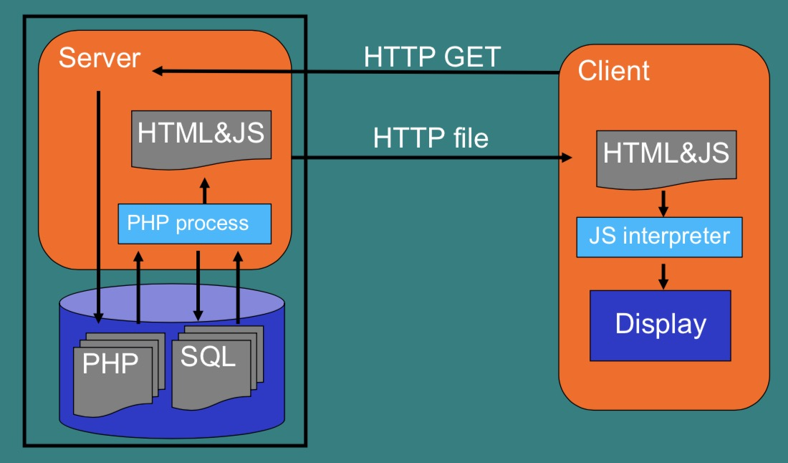
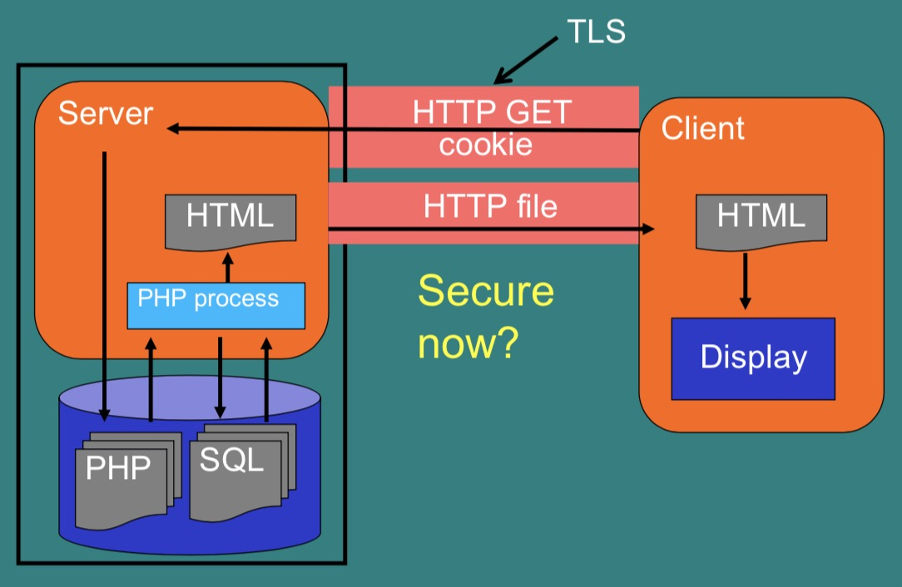

# Computer Security and Networks - Week Seven

## Web Basics



### Webserver 101
- Check open ports:
    - `nmap localhost` (http uses port 80)
- Start Apache:
    - `sudo systemctl start apache2`
- Start MySQL:
    - `sudo systemctl start mysql`
- Check again:
    - `nmap localhost`
- Standard files in /var/www/html
    - `cd /var/www/html`
    - `ls -la`
    - `nano index.html`
- View in webbrowser at (in my setup)
    - http://192.168.68.3/index.html

### PHP 101
- Will submit data to add.php
    - `nano add.php`
- add.php is a PHP script:
    - Mixed with HTML
    - Code between `<?php ?>``
    - C/Java-like syntax
    - `$_GET[]` to access GET variables
    - Similar for ``$_POST[]``

### Javascript 101
-

### Databases 101
- pageJavascript.html POSTs to resultsPass.php
- nano resultsPass.php
- Let‘s look into the DB:
    - `sudo mysql`
    - `show databases;`
    - `show tables;`
    - `use webdemo;`
    - `select * from users;`

## Web Attacks

### Typical Web Setup
#### HTTP website:
```
<form action=”http://site.com/index.jsp” method=”GET”>
    Email: <input type="text" name="email”>
    <input type="submit" value="Submit">
</form>
```
#### Users browser:
http://site.com/index.jsp?email=x@y.com

#### PHP page reads and processes:
```
<?php
$email=$_GET["emailAddress"];
mysql_query("INSERT INTO emailsTable
                VALUE(\‘".$email. "\’)";
<b>Your e-mail has been added</b>
```

### Authenticating users after log in
- IP address-based
    - NAT may cause several users to share the same IP
    - DHCP may cause same user to have different IPs
- Certificate-based
    - Who has a certificate and what is it, and who will sign it?
- Cookie-based
    - The most common

#### Cookies
Cookies let server store a string on the client.
- Based on the server name.
    - HTTP response: Set-Cookie: adds a cookie
    - HTTP header: Cookie: gives a “cookie”
- This can be used to
    - Identify the user, (cookie given out after login)
    - Store user name, preferences etc.
    - Track the user: time of last visit, etc.

#### Fixed cookies
Log in/out recorded on the server side.
- Set cookie the first time browser connects,
- Every page looks up cookie in database to get session state.

PHP does this automatically: session cookies and `start_session()`

### OWASP = Open Web Application Security Project

Public effort to improve web security:
- Many useful documents.
- Open public meetings & events.

The “10 top” lists the current biggest web threats: https://owasp.org/www-project-top-ten/

### Eavesdropping
If the connection is not encrypted, it is possible to eavesdrop, by your ISP, anyone on the route, or anyone on your local network, e.g. using the same wi-fi.

- Log in must be done using TLS (https)
-  This makes it impossible to eavesdrop the password (assuming that TLS is secure)
- After login, historically many websites dropped to http - big security flaw

### Stealing cookies
*(demo done in lecture on [google-gruyere.appspot.com](google-gruyere.appspot.com))*

An attacker doesn't need your username and password - they just need the cookie.

In Javascript you can ensure that cookies are only ever sent over secure channels:
```javascript
Cookie secureCookie =
            new Cookie(“credential”,c);
            secureCookie.setSecure(true);
```

#### OWASP A2: Broken Auth.
Many web developers implement their own log in systems. Often broken, e.g.
- No session time outs.
- Passwords not hashed

### OWASP A3: Sensitive Data Exposure
- Sensitive data transmitted in clear text (e.g. use of http instead of https)
- Sensitive data stored in clear text (e.g. passwords not hashed in database, credit card numbers not encrypted in database)
- Cookie stealing because https connection turns to http


