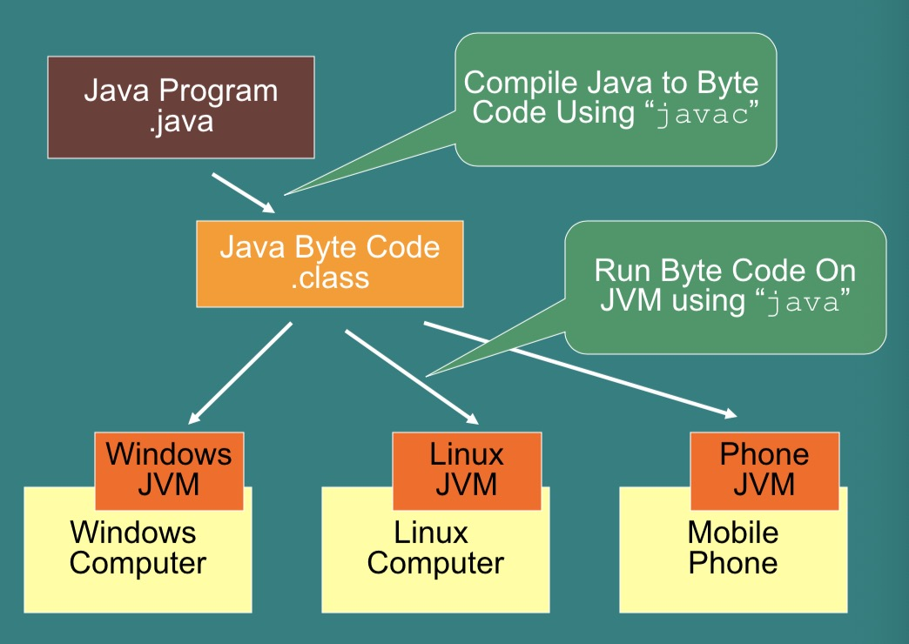
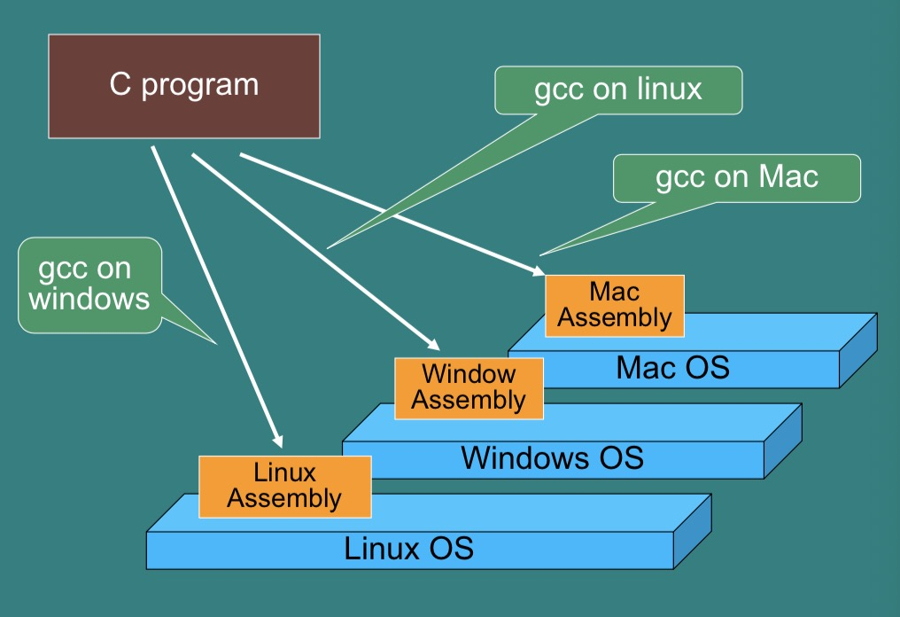
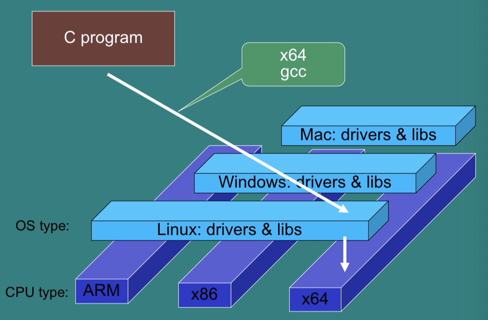
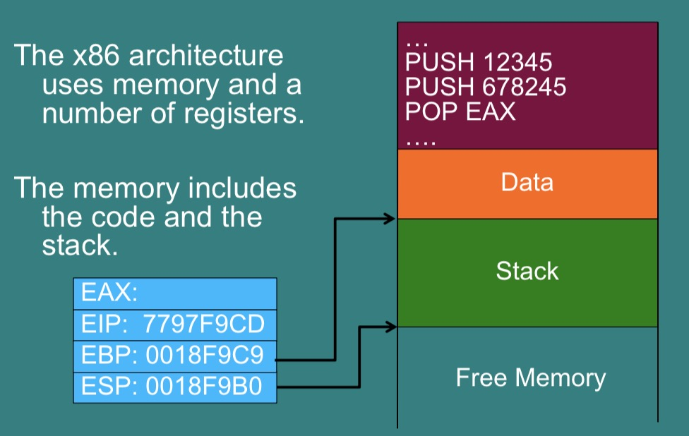

# Computer Security and Networks - Week Nine

## Binary Analysis and Application Security

Previously, we have used code injections to attack systems - sending code in to a system where data is expected. This time, we'll be doing the opposite - altering code by sending data.

In this lecture we'll deal with reverse engineering:
- Java Byte Code
- x86 Assembly

Reverse Engineering allows you to analyse malware, debug memory errors, analyse legacy code and perform security audits. It can also be used to hack. It's very hard (probably impossible) to completely prevent this, the best you can do is slow it down.

### Java Byte Code
Java compiles to *Java Byte Code*, every computer must have its own Java Virtual Machine (JVM) which runs the byte code (every different OS must have its own JVM).


The JVM is a *Stack Machine*, meaning it has a stack to hold data and a *small* number of (very fast) registers. Data is pushed onto the stack or popped off.

Some of the Byte Code instructions are as follows:
- `iconst_0` : push 0 onto the stack
- `istore_1`: pop the top of the stack as variable 1 (in register no. 1)
- `goto`: jump to line:
- `iload_1`: push variable 1 (register no. 1) onto the stack
- `iadd`: add the top two numbers on the stack.
- `if_icmpge`: if 1st item on stack =< 2nd, jump
- `Ifeq`: if 1st item on stack > 2nd, jump to line

You can type: `javap -c <ClassName>` to see the
byte code. For instance, a for loop in Java is represented like this:
```
0: iconst_1
1: istore_1
2: iconst_1
3: istore_2
4: iload_2
5: iconst_4
6: if_icmpge     26
9: iload_1
10: iload_2
11: iadd
12: istore_1
13: getstatic  #7 // Field java/lang/System.out
16: iload_1
17: invokevirtual #13 // println:(I)V 20: iinc 2, 1
23: goto 4
26: return
```

Looking at this code you can see a `System.out.println(...)` on line 17, and the `goto 4` on line 23 shows a loop. Meanwhile if you take the time to look through the rest of the instructions you'll see that the program prints out a variable (defined on line 2 as equal to 1) as it ranges from 2 to 5. (Really it adds a secondary loop variable to that first variable as the second variable ranges from 1 to 3 (inclusive)).  
If you tried to rewrite the source code (which you could do by hand or with a decompiling program) then you'd end up with something like this:

```java
public class ClassName {
    public static void main(String[] args){
        int j=1;
        for(int i=0; i<4; i++){
            j = j+i;
            System.out.println(j);
        }
    }
}
```
Often decompiled source code is obfuscated and awkward to read at first, but still all there.

De-compilation can make it a lot easier to figure out what a program is doing if you don't have access to the source code. It also makes it easy to alter and recompile the code. All code that is used to protect the code can be removed.

### Binaries



Binaries are written in assembly and are much lower level than Java byte code (though the sam techniques apply). Assembly compiled for one type of machine won't run on another.

##### IDA pro
- IDA pro is an Interactive DisAssembler.
- It helps a human understand binaries.
- This is the standard tool for malware binary analysis, security analysis of firmware and reverse engineering.
- It can also be used to rewrite/overwrite/patch binaries (such as bypassing security checks in some original code).
- There is are free & demo versions:
http://www.hex-rays.com/
- NSA released (open-source) Ghidra – very powerful as well, decide for yourself

#### x86
The x86 architecture uses memory and a number of registers, the memory includes the code in the stack.
It gives special names for important memory locations in the stack:

e.g. as you can see:
- `eax` (Extended Accumulator Register) generally contains the return of a function
- `eip` (Extended Instruction Pointer) points to the instruction to execute next.
- `ebp` (Extended Base Pointer) represents the last item of the stack
- `esp` (Extended Stack Pointer) represents the last item of the stack

as well as:
- `ecx` (Extended Counter Register) used as a counter
- `ebx` (Extended Base Register) giving the base register.

*(Useful link: https://www.aldeid.com/wiki/X86-assembly/Registers)*

##### Commands
Some x86 commands are as follows:
- `PUSH`: add to top of stack
- `CALL`: execute a function
- `RET`, `RETN`, `RETF`: end a function and restart calling code.
- `POP`: read and remove from top of stack
- `JMP`: jump to some code (like writing to EIP)
- `MOV`: move value between registers
    - `MOV r1,r2` = `PUSH r2 POP r1`
    - So move r2 into r1

After an arithmetic operation flags are set.
- ZF: Zero flag
    - Set to 1 if result is 0
- SF: Sign flag
    - Set to 1 if result is negative
- OF: Overflow flag:
    - Set to 1 if operation overflowed.

Compare and tests will set these flags, with no other affect.
- CMP a b
    - calculates a-b then sets flags
- TEST a b
    - does a bitwise “and”: a /\ b then sets flags

Jump commands are also often used:
- Jump if equal, Jump if zero –JE,JZ address
    - Jumps to address if ZF = 1
- Jump if not equal, Jump if not zero –JNE,JNZ address
    - Jumps to address if ZF =/= 0
- Jump if less than
    - JL address
    - Jump to address if SF=1 and OF=/=1

##### Common Pattern 1
Data is moved to a register, operation is called, result stored in memory location or register.
```
mov     eax, [esp+1Ch]
add     [esp+18h], eax
```
- Value at [esp+1Ch] is moved to register eax,
- It is added to the value at [esp+18h]
- The result is stored at [esp+18h]

##### Common Pattern 2
Data is compared using “cmp” or “test”, then a jump is made based on the result.
```
cmp     dword ptr [esp+1Ch], 3
jle     short loc_80483DF
```
- Value [esp+1Ch] – 3 is calculated (not stored)
- If it is less than or equal to zero, the program jumps to location “loc_80483DF”
- Otherwise it continues to the next command.

##### Common Pattern 3
Data is loaded onto the stack, then a function is called that uses these values. The result will be pointed to by eax.
```
mov     [esp+4], eax    ; s2
mov     dword ptr [esp], offset s1 ; "exit"
call    _strncmp
```
- Value in eax is moved to [esp+4]
- “exit” is put on top of the stack
- String compare is called on these.
- The result will be returned in the eax register

#### Different Systems
All of the above was for 32-bit systems, but nowadays a lot of programs are 64-bit. Most of the theory stays the same but there are a few (mostly syntactical) differences such as:
- `eax` (32-bit) -> `rax` (64 bit)
- Function calls stack vs registers (slightly different for 64 vs 32)

Also the assembly syntax can change based on the manufacturer:
- Intel vs AT&T - `mov eax, 5` vs `mov $5, %eax` etc.

#### Patching Programs
Common techniques:
- Look for strings
- Identify key tests and check the values in the register using a debugger
- Swap JEQ and JNEQ etc.
- Jump over the instructions that perform checks (replace with NOP)

### Defenses
There are a few ways to defned against binary/application analysis attacks, but remember that often these will only be able to slow down the attack - not stop it completely:

- Dynamically construct the code
    - Attacker can run code
- Encrypt the binary
    - Your program must include the key in plain text, so the attacker can find it
- Obfuscate the code, e.g. mix data and code, so it’s not clear which is which
    - Can slow down attacks by months or years! (e.g. Skype)
- Require online activation:
    - Activation can be completely disabled, users don’t like this.
- Require online content
    - e.g. WoW, BlueRay
- Hardware-based protection
    - i.e. store and run part of the code in tamper- resistant hardware.

## Summary
Machine code can be inspected and edited - many tools exist to inspect, debug and decompile code. Most software protection can be removed, but slowing this down by months or years can save a business.
